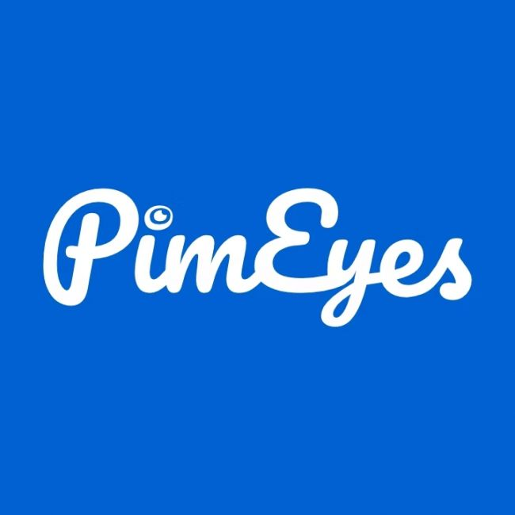

# OSINT companies

This repository contains a curated list of companies and platforms commonly used in Open-Source Intelligence (OSINT) work.  
Entries are grouped by **primary OSINT use**, not marketing claims.

---
## Core OSINT investigation platforms

Tools designed to support end-to-end investigations, link analysis, capture, or case workflows.

| Logo | Name | Country | Website | Founded | Founder(s) |
|:-:|:-|:-|:-|:-:|:-|
|  | Ubikron | South Africa | https://ubikron.com | 2025 | Roelof Temmingh |
|  | Hunchly | Canada | https://www.hunch.ly | 2015 | Justin Seitz |
|  | SpiderFoot | Australia | https://www.spiderfoot.net | 2005 | Steve Micallef |
|  | Social Links | Netherlands | https://sociallinks.io | 2015 | Ivan Schkvarun |
|  | Shadow Dragon | United States | https://shadowdragon.io | 2013 | Daniel Clemens |
|  | Graylark (GeoSpy) | United States | https://greylark.io | 2023 | Daniel Heinen |
|  | Argus Labs | France | https://argus-labs.fr | 2025 | Not disclosed |
|  | Maltego | Germany | https://www.maltego.com | 2017 | Roelof Temmingh |

## Identity, people & account discovery

| Logo | Name | Country | Website | Founded | Founder(s) |
|:-:|:-|:-|:-|:-:|:-|
|  | OSINT Industries | United Kingdom | https://www.osint.industries | 2023 | Nathaniel Fried |
|  | UserSearch | United Kingdom | https://usersearch.ai | 2014 | Lee Lewis |
|  | Epieos | France | https://epieos.com | 2019 | Sylvain Hajri |
|  | Predicta Search | France | https://predictalab.fr | 2023 | Baptiste Robert |
|  | Hunter.io | France | https://hunter.io | 2015 | Antoine Finkelstein, François Grante |
|  | Castrick | Unknown | https://castrickclues.com | Unknown | Not disclosed |
|  | FaceCheck.ID | Belize | https://facecheck.id | 2022 | Lee Chong |
|  | ScamSearch | Canada | https://scamsearch.io | 2011 | Ken Westbrook |
|  | Noimosiny | Greece | https://noimosiny.com | 2005 | Not disclosed |

## Credentials, leaks & cybercrime intelligence

| Logo | Name | Country | Website | Founded | Founder(s) |
|:-:|:-|:-|:-|:-:|:-|
|  | Have I Been Pwned | Australia | https://haveibeenpwned.com | 2013 | Troy Hunt |
|  | IntelligenceX | Czech Republic | https://intelx.io | 2018 | Peter Kleissne |
|  | Leakix | Belgium | https://leakix.net | 2021 | Danny Willems, Gregory Boddin |
|  | LeakRadar | France | https://leakradar.io | Unknown | Alexandre Vandamme |
|  | Hudson Rock | Israel | https://hudsonrock.com | 2020 | Roi Carthy |

## Internet exposure & infrastructure intelligence

| Logo | Name | Country | Website | Founded | Founder(s) |
|:-:|:-|:-|:-|:-:|:-|
|  | Shodan | United States | https://www.shodan.io | 2009 | John Matherly |
|  | Censys | United States | https://www.censys.com | 2017 | Zakir Durumeric |
|  | Onyphe | France | https://www.onyphe.io | 2017 | Patrice Auffret |
|  | Netlas | Armenia | https://netlas.io | 2020 | Arthur Kotylevskiy |
|  | ZoomEye | China | https://www.zoomeye.ai | 2013 | Not publicly listed |
|  | FOFA | China | https://en.fofa.info | 2021 | Not publicly listed |
|  | CriminalIP | South Korea | https://www.criminalip.io | 2023 | Byungtak Kang |
|  | VirusTotal | Spain (Google) | https://www.virustotal.com | 2004 | Bernardo Quintero |
|  | GreyNoise | United States | https://greynoise.io | 2017 | Andrew Morris |
|  | PulseDive | United States | https://pulsedive.com | 2017 | Dan Scary |
|  | urlscan.io | Germany | https://urlscan.io | 2020 | Johannes Gilger |
|  | Hunter.how | Unknown | https://hunter.how | Unknown | Not disclosed |

## Face identification & reverse facial search

Platforms focused on identifying or locating individuals based on facial images.  
These tools are often legally and ethically sensitive; usage depends on jurisdiction and context.

| Logo | Name | Country | Website | Founded | Founder(s) |
|:-:|:-|:-|:-|:-:|:-|
|  | PimEyes | Poland | https://pimeyes.com | 2017 | Giorgi Gobronidze |
|  | Lenso.ai | Poland | https://lenso.ai | 2023 | Not publicly disclosed |

## Geo, transport & imagery OSINT

Mapping, satellite, aviation, maritime, wireless, and street-level imagery platforms frequently used in OSINT.

| Logo | Name | Country | Website | Founded | Founder(s) |
|:-:|:-|:-|:-|:-:|:-|
|  | Flightradar24 | Sweden | https://www.flightradar24.com | 2006 | Mikael Robertsson, Olov Lindberg |
|  | FlightAware | United States | https://www.flightaware.com | 2005 | Daniel Baker |
|  | MarineTraffic | Greece | https://www.marinetraffic.com | 2007 | Dimitris Lekkas |
|  | AirNav Radar | United States | https://www.airnavradar.com | 2007 | Andre Brandão |
|  | Apollo Mapping | United States | https://www.apollomapping.com | 2011 | Katie Nelson |
|  | Sentinel Hub | Slovenia | https://www.sentinel-hub.com | 2016 | Grega Milčinski |
|  | Mapillary | Sweden | https://www.mapillary.com | 2013 | Jan Erik Solem |
|  | WiGLE | United States | https://wigle.net | 2004 | Ward Silver |

## Corporate & web metadata

| Logo | Name | Country | Website | Founded | Founder(s) |
|:-:|:-|:-|:-|:-:|:-|
|  | OpenCorporates | United Kingdom | https://opencorporates.com | 2010 | Chris Taggart |
|  | BuiltWith | Australia | https://builtwith.com | 2007 | Gary Brewer |

## Training, research & advisory

| Logo | Name | Country | Website | Founded | Founder(s) |
|:-:|:-|:-|:-|:-:|:-|
|  | MyOSINTTraining | United States | https://www.myosint.training | 2022 | Micah Hoffman |
|  | i-intelligence | Switzerland | https://i-intelligence.eu | 2010 | Chris Pallaris |

If you want to add your company to the list, feel free to request it via Issues or the contact details on the Ubikron GitHub profile.

## Our other repositories

[Ubikron Advanced Enrichments](https://github.com/ubikron/Advanced-Enrichments)  
[Awesome AI OSINT](https://github.com/ubikron/Awesome-AI-OSINT)  
[Awesome OSINT Chrome Extensions](https://github.com/ubikron/awesome-osint-chrome-extensions)  

-----

Don't miss our updates!   
[Linkedin](https://www.linkedin.com/company/ubikron/)    
[YouTube](https://www.youtube.com/@ubikron)  
