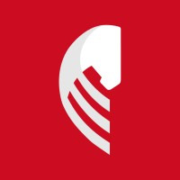
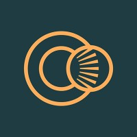
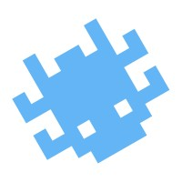
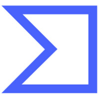
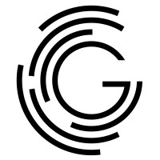
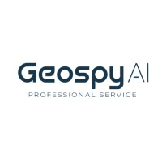
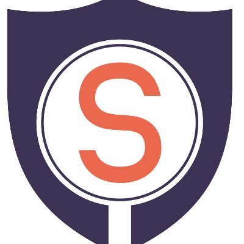
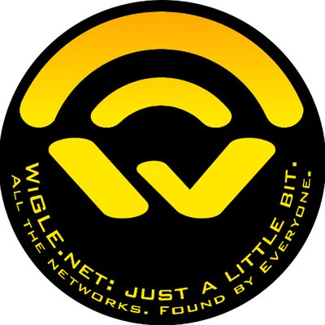

# OSINT companies

In this repository, you will find a list of companies that sell products and services for OSINT professionals. 

| Logo |  Name | Country  | Website | Start year | CEO/Founder(s) | Official product description | Main category  |  Sub category  |  Company social media  |  
|:-:|:-:|:-:|:-:|:-:|:-:|:-:|:-:|:-:|:-:|
|  | Ubikron| South Africa| https://ubikron.com| 2025| Roelof Temmingh| Ubikron keeps track of every step in your research, storing, tagging, and enriching the trail so you can follow the story wherever it leads.| services| investigation tool| https://www.linkedin.com/company/ubikron| 
|  | OSINT Industries| United Kingdom| https://www.osint.industries/| 2023| Nathaniel Fried| OSINT Industries is an automated & scalable email, phone number & username checker tool for Law Enforcement, Private Investigators, Government and OSINT Practitioners| people| search by email/phone| https://www.linkedin.com/company/osint-industries/| 
|  | Have I Been Pwned| Australia| https://haveibeenpwned.com/| 2013| Troy Hunt| Check if your email address is in a data breach| people| leaks database search| https://www.linkedin.com/company/haveibeenpwned/| 
|  | UserSearch| United Kingdom| https://usersearch.ai/| 2014| Lee Lewis| A Professional Forensic OSINT Platform. All your investigation tools, datasets & techniques in one platform| people| search by email/phone| https://www.linkedin.com/showcase/usersearch/| 
|  | Epieos| France| https://epieos.com| 2019| Sylvain Hajri| The ultimate OSINT tool for email and phone reverse lookup| people| search by email/phone| https://www.linkedin.com/company/epieos/| 
|  | Shodan| United States| https://www.shodan.io| 2009| John Matherly| Monitor your external network, search the Internet of Things and perform empirical market research| infrastructure| ip search engine| https://www.linkedin.com/company/shodan/| 
|  | Censys| United States| https://www.censys.com| 2017| Zakir Durumeric| Authoritative map of global Internet infrastructure used by organizations worldwide to uncover risks faster, | infrastructure| ip search engine| https://www.linkedin.com/company/censysio/| 
|  | Netlas| Armenia| https://netlas.io| 2020| Arthur Kotylevskiy| Discover, scan and monitor any online assets| infrastructure| ip search engine| https://www.linkedin.com/company/netlas-io/| 
|  | Virus Total| Spain (USA(Google now?)| http://www.virustotal.com| 2004| Bernardo Quintero| Analyse suspicious files, domains, IPs and URLs to detect malware and other breaches, automatically share them with the security community.| infrastructure| domain info| https://www.linkedin.com/company/virustotal/| 
|  | Pulse Dive| United States| https://pulsedive.com| 2017| Dan Scary| Frictionless threat intelligence for growing teams| infrastructure| domain info| https://www.linkedin.com/company/pulsedive/| 
|  | Maltego| South Africa (Germany now)| https://www.maltego.com/| 2017| Roelof Temmingh| From data to intelligence - in minutes.| services| investigation tool| https://www.linkedin.com/products/maltego/| 
|  | IntelligenceX| Czech Republic| https://intelx.io/| 2018| Peter Kleissne| Search engine and data archive.| people| leaks database search| https://www.linkedin.com/company/intelxio/| 
|  | Spider Foot| Australia (USA now?)| https://www.spiderfoot.net| 2005| Steve Micallef| Automates OSINT for Threat Intel and mapping your attack surface.| services| investigation tool| https://www.linkedin.com/company/spiderfoot/| 
|  | GreyNoise| United States| https://greynoise.io/| 2017| Andrew Morris| Detect attacks on edge systems in real-time| infrastructure| ip search engine| https://www.linkedin.com/company/greynoise/| 
|  | URLScanIO| Germany| https://urlscan.io| 2020| Johannes Gilger| A sandbox for the web| infrastructure| ip search engine| https://www.linkedin.com/company/urlscan/| 
|  | Hunchly| Canada| https://www.hunch.ly| 2015| Justin Seitz| Capture, organize, and preserve information from online research, safely, quickly, and easily.| services| investigation tool| https://www.linkedin.com/company/hunchly/| 
|  | Forensic OSINT| Canada| https://www.forensicosint.com| 2023| Ritu Gull| OSINT Web Capture Software| infrastructure| investigation tool| https://www.linkedin.com/company/forensicosint/| 
|  | Onyphe| France| https://www.onyphe.io| 2017| Patrice Auffret| Discover your/any exposed assets| infrastructure| ip search engine| https://www.linkedin.com/company/onyphe/| 
|  | FOFA (Beijing Huashun Xin'an Technology Co., Ltd)| China| https://en.fofa.info/| 2021| | Cybersecurity Search Engine| infrastructure| ip search engine| https://x.com/fofabot| 
|  | Social Links| Netherlands| https://sociallinks.io/| 2015| Ivan Schkvarun| OSINT Investigation Tool| services| investigation tool| https://x.com/_SocialLinks_| 
|  | Hudson Rock| Israel| https://hudsonrock.com| 2020| Roi Carthy| Aaugmented cybercrime database, composed of millions of machines compromised by Infostealers in global malware spreading campaigns| infrastructure| cybercrime database| https://www.linkedin.com/company/hudson-rock/| 
|  | Graylark| USA| https://greylark.io| 2023| Daniel Heinen| Enhance your investigations with AI-powered location intelligence designed to help government and law enforcement teams uncover critical insights faster and with greater precision| services| investigation tool| https://www.linkedin.com/company/geospy-ai/| 
|  | ScamSearch| Canada (USA now?)| https://scamsearch.io/| 2011|  Ken Westbrook| Global Scam Database| people| cybercrime database| https://x.com/scamsearch_real| 
|  | Castrick| | https://castrickclues.com/| | | Find clues about anyone without leaving a trace| people| search by email/phone| https://www.linkedin.com/company/castrick/| 
|  | Open Corporates| United Kingdom| https://OpenCorporates.com| 2010| Chris Taggart| Fresh, standardized, auditable information direct from official primary sources across 140+ jurisdictions — all underpinned by our Legal-Entity Data Principles and world-leading expertise in legal-entity data. This is data you can trust| people| company database| https://www.linkedin.com/company/opencorporates/| 
|  | FaceCheckID| Belize| https://facecheck.id/| 2022| Lee Chong| Find People Online by Photo| people| reverse image search| | 
|  | Predicta Search| France| https://predictalab.fr| 2023| Baptiste Robert| Get the digital footprint from an email or phone number| people| search by email/phone| https://www.linkedin.com/company/predicta-lab/| 
|  | TineEye| Canada| https://tineye.com/| 2008| Leila Boujnane| Search over 81 billion images and find where images appear online| people| reverse image search| https://www.linkedin.com/company/tineye/| 
|  | Wigle| United Kingdom| https://wigle.net/| 2004| Andrew Carra| All the networks. Found by Everyone.| infrastructure| online map| https://x.com/wiglenet| 
|  | ZoomEye| China (USA now?)| https://www.zoomeye.ai/| 2013| | A cyberspace search engine built for security researcher| infrastructure| ip search engine| https://x.com/zoomeye_team| 
|  | CriminalIP| South Korea| https://www.criminalip.io/| 2023|  Byungtak Kang| Comprehensive web-based cyber threat intelligence search engine| infrastructure| ip search engine| https://x.com/CriminalIP_US| 
|  | Hunter how| | https://hunter.how| | | Internet search engine for Internet researchers| infrastructure| ip search engine| https://x.com/HunterMapping| 
|  | HuntIntelligence| United Kingdom| https://huntIntel.io| 2022| Louis Tomos Evans| Focused on building innovative and user-friendly OSINT Tools for everyone to use.| geo| online map| https://x.com/HuntIntel| 
|  | ApolloMapping| United States| https://www.apollomapping.com| 2011| Katie Nelson| Search and buy from the largest satellite imagery archive| geo| online map| https://www.linkedin.com/company/apollo-mapping/| 
|  | FlightRadar| Sweden| https://www.flightradar24.com/| 2006| Mikael Robertsson, Olov Lindberg| The best live flight tracker that shows air traffic in real time| geo| online map| https://x.com/flightradar24| 
|  | Noimosiny| Greece| https://noimosiny.com/| 2005| | Open Source Intelligence with our advanced tools and modules. Gather clues from 250+ modules with one click.| people| search by email/phone| https://x.com/NoimosinyOSINT| 
|  | BuiltWith| Australia| https://builtwith.com| 2007| Andrew Rogers, Gary Brewer| Find out what websites are Built With| infrastructure| domain info| https://www.linkedin.com/company/builtwith/| 
|  | MarineTraffic| Greece| https://www.marinetraffic.com/| 2007| Dimitris Lekkas| Global Ship Tracking Intelligence| geo| online map| https://www.linkedin.com/company/marinetraffic/| 
|  | AirNavRadar| United States| https://www.airnavradar.com/| 2007| Andre Brandão| Live Flight Tracker and Airport Status| geo| online map| https://www.linkedin.com/company/airnav-systems/| 
|  | Mapillary| Sweden| https://www.mapillary.com/| 2013| Jan Erik Solem, Yubin Kuang, Peter Neubauer, Johan Gyllenspetz| Mapillary is the platform that makes street-level images and map data available to scale and automate mapping| geo| online map| https://x.com/mapillary| 
|  | Sentinel Hub| Slovenia| https://www.sentinel-hub.com/| 2016| Grega Milčinski| Easily extract insights from Earth observation data and build your own applications on top of Planet Insights Platform — without having to build or manage your own infrastructure.| geo| online map| https://www.linkedin.com/showcase/sentinel-hub/| 
|  | Hunter io| April| https://hunter.io/| 2015| Antoine Finkelstein, François Grante | | people| search by email/phone| https://www.linkedin.com/company/hunterio/| 
|  | FlightAware| United States| https://www.flightaware.com/| 2005| Daniel Baker| All-in-one email outreach platform| geo| online map| https://www.linkedin.com/company/flightaware/| 
|  | Leakix| Belgium| https://leakix.net/| 2021| Danny Willems, Gregory Boddin| Goes around the Internet and finds services to index them.| people| leaks database search| https://www.linkedin.com/company/leakix/| 
|  | LeakRadar| France| https://leakradar.io| | Alexandre Vandamme| Search over 201 billion plain text credentials collected from malware logs, combolists, database breaches and dark-web dumps, and get alerted before attackers act.| people| leaks database search| https://www.linkedin.com/company/leakradar/| 
|  | Shadow Dragon| United States| https://shadowdragon.io/| 2013(2016?)| Daniel Clemens| Discover the power of precision OSINT.  Built for Investigators. Trusted by Experts. Conduct comprehensive, ethical investigations.| services| investigation tool| https://www.linkedin.com/company/shadowdragon/| 
|  | MyOSINTTraining| United States| https://www.myosint.training/| 2022| | Home for OSINT learning| services| trainings| https://www.linkedin.com/company/my-osint-training/| 
|  | i intelligence| Switzerland| https://i-intelligence.eu/| 2010| Chris Pallaris| Works at the intersection of intelligence, foresight, strategy and policy. We offer a unique portfolio of research, training and advisory services to public and private sector organisations operating in challenging environments.| services| trainings| https://www.linkedin.com/company/i-intelligence/| 
|  | Argus Labs| France| https://argus-labs.fr/en| 2025| | Turn Complex Data into. Investigate faster. Correlate entities across open web, blockchain, and leaks in a unified, collaborative graph.| services| investigation tool| https://x.com/arguslabs_int| 

If you want to add your company to the list, feel free to request that it be added to this repository!

Use Issues or the contact details on the main page of Ubikron's Github profile.

## Our other repositories

[Ubikron Advanced Enrichments](https://github.com/ubikron/Advanced-Enrichments)  
[Awesome AI OSINT](https://github.com/ubikron/Awesome-AI-OSINT)  
[Awesome OSINT Chrome Extensions](https://github.com/ubikron/awesome-osint-chrome-extensions)  

-----

Don't miss our updates!   
[Linkedin](https://www.linkedin.com/company/ubikron/)    
[YouTube](https://www.youtube.com/@ubikron)  

